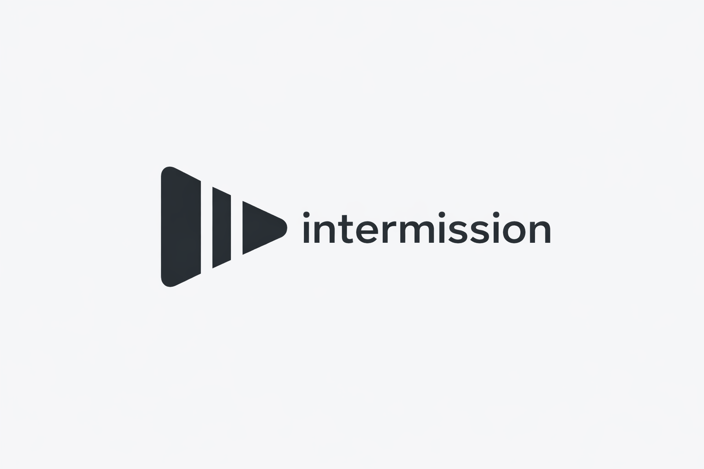

<p align="center">
  
</p>

# Intermission

A modern macOS menu bar app that automatically pauses your media (Netflix, YouTube, etc.) when you start talking and resumes when you're done.

Perfect for watching shows with friends or family - no more manually pausing when someone starts a conversation!

## Features

- **Real-time Voice Activity Detection** using WebRTC VAD
- **Smart State Machine**
  - Pauses after ~250ms of detected speech
  - Resumes after ~1.2s of silence
  - Cooldown period to prevent spam toggles
- **Adjustable Sensitivity** (Quality, Low Bitrate, Aggressive, Very Aggressive)
- **Clean Menu Bar UI** - Unobtrusive and always accessible
- **Low Latency** - Fast, offline detection with minimal CPU usage
- **Privacy First** - All processing happens locally, no data leaves your Mac

## Screenshots

The app lives in your menu bar with a simple pause icon. Click it to see the control panel with:
- On/Off toggle
- Sensitivity slider
- Real-time status indicator
- Permission management

## Requirements

- macOS 13.0 (Ventura) or later
- Microphone permission
- Accessibility permission (for keyboard simulation)
- Xcode 15.0+ (for building)

## Building the App

### Prerequisites

1. Install Xcode from the Mac App Store
2. Install Xcode Command Line Tools:
   ```bash
   xcode-select --install
   ```

### Build Steps

1. **Clone or navigate to the project directory**:
   ```bash
   cd /Users/creativnativ/Desktop/Netflix-Idea/Intermission
   ```

2. **Build using Swift Package Manager**:
   ```bash
   swift build -c release
   ```

3. **Or open in Xcode**:
   ```bash
   open Package.swift
   ```
   Then press `Cmd+B` to build or `Cmd+R` to run.

### Creating an Xcode Project (Alternative)

If you prefer working with an Xcode project:

1. Create a new macOS App in Xcode (File → New → Project)
2. Name it "Intermission"
3. Choose SwiftUI for the interface
4. Copy all files from `Sources/` to your project
5. Copy all files from `WebRTCVAD/` to your project
6. Add a bridging header if needed for the C code
7. Configure Info.plist with required permissions:
   - `NSMicrophoneUsageDescription`: "Intermission needs microphone access to detect when you're speaking"
   - Add Hardened Runtime capability
   - Enable App Sandbox (with microphone access)

## Permissions Setup

The app requires two permissions to function:

### 1. Microphone Permission
- The app will automatically request this on first launch
- Grant access when prompted

### 2. Accessibility Permission
This allows the app to simulate the spacebar key press:

1. Open **System Settings** → **Privacy & Security** → **Accessibility**
2. Click the lock icon to make changes
3. Click the **+** button
4. Navigate to and add the Intermission app
5. Ensure the checkbox next to Intermission is enabled

**Note**: The app will guide you through these steps and can open System Settings directly.

## Usage

1. **Launch the app** - It appears in your menu bar as a pause icon
2. **Click the icon** to open the control panel
3. **Click "Start Listening"** to activate voice detection
4. **Adjust sensitivity** if needed:
   - **Quality (0)**: Less sensitive, best for quiet environments
   - **Low Bitrate (1)**: Balanced sensitivity
   - **Aggressive (2)**: More sensitive, good for normal environments *(default)*
   - **Very Aggressive (3)**: Most sensitive, for noisy environments
5. **Start watching** Netflix, YouTube, or any media player
6. **Talk naturally** - The app will pause after ~250ms of speech
7. **Stay silent** - The app resumes after ~1.2s of silence

### Tips

- The app works with any video player that responds to the spacebar key
- Adjust sensitivity based on your environment (noisy room vs quiet room)
- The status indicator shows what state the app is in:
  - "Listening for speech..." - Active and monitoring
  - "Speech detected" - Voice detected, waiting to pause
  - "Media paused" - Currently paused
  - "Cooldown period" - Temporary pause before resuming monitoring

## How It Works

### Voice Activity Detection
Intermission uses **WebRTC VAD** (Voice Activity Detector), a battle-tested algorithm from Google's WebRTC project. It analyzes:
- **Energy levels** - Detects sound above background noise
- **Zero-crossing rate** - Distinguishes speech from other sounds
- **Temporal patterns** - Tracks energy history for context

Unlike simple volume threshold detection, VAD is specifically designed to detect human speech patterns.

### State Machine
The app uses a sophisticated state machine to prevent false triggers:

```
IDLE → Speech detected (>200ms) → SPEECH_DETECTED
     ↓                                    ↓
   Silence                         Spacebar pressed
     ↓                                    ↓
Continue listening ← COOLDOWN ← PAUSED ← Continue speech
                         ↓           ↓
                    (~1.5s)    Silence (>1.2s)
```

This ensures:
- Brief sounds don't trigger pauses
- Short pauses in conversation don't resume playback
- Rapid pause/resume cycles are prevented

### Keyboard Simulation
The app uses Core Graphics' CGEvent API to simulate spacebar presses, which works universally across:
- Netflix
- YouTube
- Disney+
- Apple TV
- VLC
- QuickTime
- And virtually any media player

## Technical Architecture

```
┌─────────────────────────────────────────────┐
│          SwiftUI Menu Bar App               │
├─────────────────────────────────────────────┤
│  • Intermission.swift (App Entry)           │
│  • ContentView.swift (UI)                   │
│  • AudioManager.swift (Audio Processing)    │
│  • VADProcessor.swift (Voice Detection)     │
│  • KeyboardSimulator.swift (Key Events)     │
└──────────┬──────────────────────────────────┘
           │
           ├──► AVAudioEngine (Audio Capture)
           │
           ├──► WebRTC VAD (C Library)
           │    └─ Energy analysis
           │    └─ Zero-crossing rate
           │    └─ Speech pattern detection
           │
           └──► CoreGraphics (Keyboard Events)
```

## Project Structure

```
Intermission/
├── Package.swift               # Swift Package Manager configuration
├── README.md                  # This file
├── Sources/
│   ├── Intermission.swift     # App entry point & menu bar setup
│   ├── ContentView.swift      # SwiftUI interface
│   ├── AudioManager.swift     # Audio capture & state machine
│   ├── VADProcessor.swift     # WebRTC VAD wrapper
│   └── KeyboardSimulator.swift # Spacebar simulation
└── WebRTCVAD/
    ├── webrtc_vad.h          # C header
    └── webrtc_vad.c          # VAD implementation
```

## Customization

### Adjusting Timing Thresholds
Edit [AudioManager.swift:17-19](Sources/AudioManager.swift#L17-L19):

```swift
private let speechThreshold: TimeInterval = 0.25      // Time before pausing
private let silenceThreshold: TimeInterval = 1.2      // Time before resuming
private let cooldownDuration: TimeInterval = 1.5      // Cooldown period
```

### Changing the Key Press
Edit [KeyboardSimulator.swift:8](Sources/KeyboardSimulator.swift#L8) to use a different key:

```swift
let keyCode: CGKeyCode = 49 // 49 = spacebar, 53 = escape, etc.
```

### Adjusting Audio Processing
Edit [AudioManager.swift:67-70](Sources/AudioManager.swift#L67-L70) to change audio format:

```swift
let targetFormat = AVAudioFormat(commonFormat: .pcmFormatInt16,
                                sampleRate: 16000,  // Change sample rate
                                channels: 1,         // Mono/stereo
                                interleaved: false)
```

## Troubleshooting

### App doesn't pause media
- Ensure Accessibility permission is granted
- Try clicking in the media player window to ensure it's focused
- Check that the media player responds to spacebar (most do)

### Too sensitive / Not sensitive enough
- Adjust the sensitivity slider in the app
- Try different modes:
  - Too many false positives? → Lower sensitivity
  - Not detecting your voice? → Higher sensitivity

### High CPU usage
- The app is designed to be lightweight (~1-2% CPU)
- If experiencing high CPU, try:
  - Lowering the sample rate in AudioManager.swift
  - Reducing the buffer size (currently 512 frames)

### Permissions not working
- For microphone: Go to System Settings → Privacy & Security → Microphone
- For accessibility: Go to System Settings → Privacy & Security → Accessibility
- You may need to remove and re-add the app

## Future Enhancements

Potential improvements:
- [ ] App icon and custom design
- [ ] Configurable keyboard shortcuts
- [ ] Support for media keys instead of spacebar
- [ ] Detection history visualization
- [ ] Export settings/profiles
- [ ] Alternative VAD engines (Silero VAD for even better accuracy)
- [ ] Multi-language speech detection
- [ ] Training mode to calibrate for your voice

## Contributing

This is a personal project, but contributions are welcome! Some areas for improvement:
- Better VAD implementation (integrate full WebRTC VAD or Silero)
- UI/UX enhancements
- Additional keyboard shortcut options
- Bug fixes and optimizations

## License

This project is provided as-is for personal use. Feel free to modify and adapt for your needs.

## Acknowledgments

- **WebRTC VAD** - Google's Voice Activity Detection algorithm
- **SwiftUI** - Apple's modern UI framework
- **AVFoundation** - Apple's audio processing framework

---

**Enjoy uninterrupted conversations while binge-watching!** 🎬🗣️
